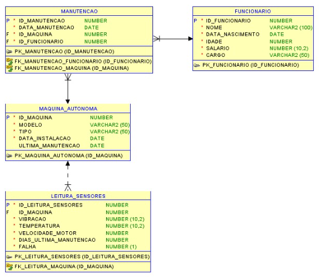
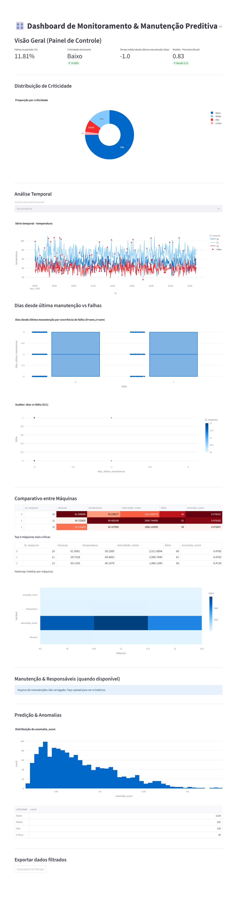

# Enterprise Challenge – Sprint 3 – Reply

**Projeto:** Enterprise Challenge - Sprint 3 - Reply  
**Resumo:** Repositório com modelagem de banco de dados (Oracle 12cR2), pipeline de ML para leituras de sensores (`pipeline_sensor5.py`) e scripts de apoio para ingestão, explicações SHAP e avaliação contínua. Este README reúne a documentação executiva e técnica: modelagem do BD, implementação do ML e principais resultados.

---

## 🧭 1 — Como o banco de dados foi modelado

# 📊 Modelagem de Banco de Dados — Cenário Industrial

> **Projeto acadêmico/industrial** voltado para registro de **máquinas autônomas**, suas **leituras de sensores** e o **histórico de manutenções** realizadas.  
> Desenvolvido em **Oracle SQL Developer Data Modeler (v. 24.x)**, com base no **RDBMS Oracle 12cR2**.

---

## 🎯 Objetivo

Modelar um banco de dados que garanta **integridade, rastreabilidade e qualidade dos dados**, contemplando:

- Cadastro de máquinas autônomas.
- Leituras periódicas de sensores.
- Registro de funcionários responsáveis.
- Histórico completo de manutenções.

---

## 🛠️ Ferramentas e Tecnologias

- **Oracle SQL Developer Data Modeler** (v. 24.x)  
- **Oracle Database 12cR2**  
- **Exportação DER** em imagem PNG (300–400 DPI)  
- **DDL gerado** com PKs, FKs, CHECKs e índices.  

---

## 📐 Processo de Desenvolvimento

1. Criação das entidades e atributos com PK/FK.  
2. Definição de restrições (NOT NULL, CHECK, DEFAULT, etc.).  
3. Importação e comparação de modelos (DDL → Model).  
4. Organização do layout e criação de SubView.  
5. Exportação do **DER em PNG**.  

---

## 🗂️ Entidades e Principais Atributos

### 🏭 `MAQUINA_AUTONOMA`
- **ID_MAQUINA (PK)** — identity.  
- **MODELO** — varchar(50), obrigatório.  
- **TIPO** — solda, corte, montagem, pintura.  
- **DATA_INSTALACAO** — obrigatório, default `SYSDATE`.  
- **ULTIMA_MANUTENCAO** — opcional.  

---

### 👷 `FUNCIONARIO`
- **ID_FUNCIONARIO (PK)** — identity.  
- **NOME** — varchar(100).  
- **DATA_NASCIMENTO**, **IDADE**.  
- **SALARIO** — mínimo R$ 1.518,00.  
- **CARGO** — varchar(50).  

---

### 📡 `LEITURA_SENSORES`
- **ID_LEITURA_SENSORES (PK)** — identity.  
- **ID_MAQUINA** — pode ser nulo (leituras de teste).  
- **VIBRACAO** (0–100 %).  
- **TEMPERATURA** (-50 a 150 °C).  
- **VELOCIDADE_MOTOR** (0–10000 RPM).  
- **DIAS_ULTIMA_MANUTENCAO** ≥ 0.  
- **FALHA** — 0 = não, 1 = sim.  

---

### 🛠️ `MANUTENCAO`
- **ID_MANUTENCAO (PK)** — identity.  
- **DATA_MANUTENCAO** — obrigatória.  
- **ID_MAQUINA** — obrigatória (FK).  
- **ID_FUNCIONARIO** — obrigatória (FK).  

---

## 🔗 Relacionamentos

- **MAQUINA_AUTONOMA (1) → (N) LEITURA_SENSORES**  
- **MAQUINA_AUTONOMA (1) → (N) MANUTENCAO**  
- **FUNCIONARIO (1) → (N) MANUTENCAO**  

> Observação: FKs não possuem `ON DELETE`, garantindo consistência via `RESTRICT/NO ACTION`.

---

## 🛡️ Regras de Integridade

✔ **Entidade** → PK com `IDENTITY`.  
✔ **Referencial** → FKs obrigatórias (exceto `ID_MAQUINA` em `LEITURA_SENSORES`).  
✔ **Domínio** → CHECK constraints (faixas de temperatura, vibração, salário, etc.).  
✔ **Nulidade** → colunas obrigatórias marcadas como `NOT NULL`.  

---

## ⚙️ Exemplos de Interação

- Cadastro de máquina → gera `ID_MAQUINA` automático.  
- Registro de leitura → pode estar vinculada a máquina ou não.  
- Abertura de manutenção → exige máquina + funcionário válidos.  

---der

## 📊 DER — Diagrama Entidade Relacionamento

📌 *Inserir aqui a imagem exportada do Oracle SQL Developer Data Modeler*  
*(Exemplo de placeholder abaixo)*  




---

## 💾 Script DDL (Oracle 12cR2)


-- Criação da tabela MAQUINA_AUTONOMA
CREATE TABLE MAQUINA_AUTONOMA (
  ID_MAQUINA         NUMBER GENERATED ALWAYS AS IDENTITY,
  MODELO             VARCHAR2(50) NOT NULL,
  TIPO               VARCHAR2(50) NOT NULL,
  DATA_INSTALACAO    DATE DEFAULT SYSDATE NOT NULL,
  ULTIMA_MANUTENCAO  DATE,
  CONSTRAINT PK_MAQUINA_AUTONOMA PRIMARY KEY (ID_MAQUINA),
  CONSTRAINT CHK_MAQUINA_TIPO CHECK (TIPO IN ('Solda','Corte','Montagem','Pintura'))
);

-- (... demais tabelas abaixo ...)
# 📊 Machine Learning Pipeline — `pipeline_sensor5.py`

Este repositório contém a implementação de um **pipeline completo de pré-processamento, enriquecimento e modelagem de dados de sensores industriais**, com suporte a aprendizado supervisionado (classificação de falhas) e não supervisionado (detecção de anomalias).

---

## 🚀 2 — Como foi feita a implementação do ML

O script `pipeline_sensor5.py` recebe como entrada um **CSV com leituras de sensores** (mais arquivos opcionais: máquinas, funcionários, manutenção) e gera:

- ✅ `dados_sensores_clean.csv` → dataset limpo e enriquecido.
- ✅ `metricas_classificacao.csv` → métricas de classificação (se houver coluna *falha*).
- ✅ `dados_sensores_resultados.csv` → resultados com *score de anomalia* e *criticidade*.
- ✅ Figuras opcionais → matriz de confusão e curva ROC.

Também realiza **detecção de anomalias via IsolationForest**, classificando leituras em *Baixo / Médio / Alto / Crítico*.

---

## 🔄 Fluxograma do Pipeline

Abaixo, a versão do fluxograma já exportada como imagem **embutida em Base64** (auto-contida, sem dependências externas):


> ⚠️ Substitua o conteúdo entre `data:image/png;base64, ...` pelo base64 real do fluxograma exportado.

---

## 🗂️ Estrutura do Código

1. **Imports & Logging** → `sklearn`, `pandas`, `numpy`, `matplotlib`, `logging`.
2. **Helpers (utils)**
   - `slugify_colname()`, `CANONICAL_MAP`
   - `robust_read_csv()`
   - `map_falha_to_int()`
   - `ensure_dir()`
3. **Validação & Enriquecimento** → ranges, merges, cálculo de `dias_ultima_manutencao`.
4. **Main Flow** → ingestão, pré-processamento, modelagem, anomalias, salvamento.

---

## ⚙️ Passo a Passo Técnico

1. **Leitura Robusta** → múltiplos encodings.
2. **Canonicalização de Colunas** → nomes uniformes.
3. **Mapeamento da Coluna Falha** → `{0,1}`.
4. **Validação de Domínio** → vibracao, temperatura, velocidade_motor, falha.
5. **Validação Referencial & Enriquecimento** → join com máquinas, manutenção, funcionários.
6. **Feature Engineering** → features numéricas e categóricas.
7. **Dataset Limpo** → exportado para `dados_sensores_clean.csv`.
8. **Modelagem Supervisionada (quando falha disponível)** → RandomForest + métricas.
9. **Detecção de Anomalias (sempre)** → IsolationForest + criticidade.
10. **Exportação Final** → `dados_sensores_resultados.csv` + figuras.

---

## 🔑 Hiperparâmetros Principais

- **RandomForestClassifier** → `n_estimators=200`, `class_weight="balanced"`
- **Split** → `train_test_split(test_size=0.25, stratify=y)`
- **Pré-processamento** → imputação por mediana/frequência + StandardScaler + OneHotEncoder
- **IsolationForest** → `n_estimators=200`, `contamination=0.02`
- **Criticidade** → bins `[0,0.75,0.9,0.98,1.0]` → `Baixo/Médio/Alto/Crítico`

---

## 🛠️ Artefatos Gerados

- `outdir/relatorios/dados_sensores_clean.csv`
- `outdir/relatorios/metricas_classificacao.csv`
- `outdir/relatorios/dados_sensores_resultados.csv`
- `outdir/figs/confusion_matrix.png`
- `outdir/figs/roc_curve.png`

---

## ⚠️ Limitações

1. **Leakage temporal** → usar split temporal para produção.
2. **Contaminação arbitrária** no IsolationForest (ajustar `contamination`).
3. **Desequilíbrio de classes** → avaliar técnicas adicionais (SMOTE, undersampling).
4. **Modelos globais** → considerar segmentação por máquina/tipo.
5. **Escalabilidade** → pipeline atual roda em memória (pandas).
6. **Feature engineering limitado** → sem extração temporal/FFT.
7. **Explicabilidade** → considerar SHAP/LIME.

---

## 🚀 Recomendações Futuras

- Validação temporal realista.
- Cross-validation e otimização de hiperparâmetros.
- Persistência do modelo (joblib).
- Monitoring de drift/performance.
- Novas features: agregações temporais, FFT de vibração.
- Modelos calibrados e ensemble de detectores de anomalias.
- Registro de experimentos (MLflow, W&B).

---

## 📊 Exemplos de Campos Importantes

| Campo               | Descrição | Exemplo | Uso Prático |
|---------------------|-----------|---------|-------------|
| `id_sensor`         | Identificador único do sensor | `SEN_0345` | Auditoria/calibração |
| `id_maquina`        | Identificador da máquina | `MAQ_TORNO_07` | Agrupar leituras |
| `ts`                | Timestamp da leitura | `2025-09-07 14:32:10` | Séries temporais |
| `vibracao`          | Nível de vibração (0–100) | `92` | Indica desgaste |
| `temperatura`       | Temperatura (°C) | `105` | Detecta sobrecarga |
| `velocidade_motor`  | Rotação (RPM) | `2800` | Contextualiza vibração |
| `dias_ultima_manutencao` | Dias desde a última manutenção | `200` | Criticidade alta |
| `falha`             | Ocorrência de falha (0/1) | `1` | Alvo supervisado |
| `modelo`            | Modelo da máquina | `TX-500` | Tolerâncias específicas |
| `tipo`              | Tipo da máquina | `Torno` | Segmentação |
| `anomalia_score`    | Score de anomalia (IForest) | `1.5` | Grau de estranheza |
| `anomalia_rank_pct` | Percentil relativo | `0.995` | Triagem de alertas |
| `criticidade`       | Nível categórico | `Crítico` | Tomada de decisão |

---

## ▶️ Como Executar

```bash
# Instalar dependências
pip install pandas numpy scikit-learn matplotlib

# Executar pipeline
python pipeline_sensor5.py \
    --csv dados_sensores.csv \
    --maquinas maquinas.csv \
    --funcionarios funcionarios.csv \
    --manutencao manutencao.csv \
    --outdir saida

# Executar dashboard interativo
streamlit run dashboard_avancado.py
```

Saídas principais:
- `saida/relatorios/dados_sensores_clean.csv`
- `saida/relatorios/metricas_classificacao.csv`
- `saida/relatorios/dados_sensores_resultados.csv`
- `saida/figs/`



---


---

## 📑 Descrição Técnica dos Campos (com Exemplos e Métricas)

### 1. `id_sensor`
- **Descrição:** Identificador único do sensor que gerou a leitura.  
- **Relevância:** Permite rastrear qual dispositivo físico originou a medição. Essencial para auditoria, calibração e manutenção de sensores específicos.  
- **Exemplos:** `SEN_0345`, `SEN_1012`.  
- **Uso prático:** facilita a investigação quando um sensor apresenta leituras anômalas repetidas.

### 2. `id_maquina`
- **Descrição:** Identificador único da máquina em que o sensor está instalado.  
- **Relevância:** Fundamental para cruzar leituras de sensores com dados cadastrais (modelo, tipo, última manutenção).  
- **Exemplos:** `MAQ_TORNO_07`, `MAQ_INJ_22`.  
- **Uso prático:** agrupa leituras e ajuda a identificar máquinas com maior risco de falha.

### 3. `ts` (timestamp)
- **Descrição:** Data e hora da leitura do sensor.  
- **Relevância:** Base para análises temporais, como séries históricas, sazonalidade e detecção de falhas ao longo do tempo.  
- **Exemplo:** `2025-09-07 14:32:10`.  
- **Uso prático:** análises de evolução gradual, como aumento de vibração em dias consecutivos.

### 4. `vibracao` (0–100)
- **Descrição:** Nível de vibração detectado pelo sensor.  
- **Relevância:** Alta vibração indica desgaste de rolamentos, desbalanceamento ou desalinhamento.  
- **Faixas típicas:** Normal: 15–30 | Médio risco: 40–60 | Crítico: >80  
- **Uso prático:** leitura `92` → `anomalia_rank_pct 0.985` → `criticidade Crítico`.

### 5. `temperatura` (°C)
- **Descrição:** Temperatura medida na máquina.  
- **Relevância:** Excesso de temperatura pode apontar sobrecarga, falha de lubrificação ou refrigeração.  
- **Faixas típicas:** Normal: 40–70 °C | Alerta: 75–90 °C | Crítico: >95 °C  
- **Uso prático:** temperatura `105 °C` classifica leitura como **Crítico**, mesmo sem falha registrada.

### 6. `velocidade_motor` (RPM)
- **Descrição:** Rotação do motor.  
- **Relevância:** Contextualiza outras medições (ex.: vibração alta pode ser esperada em rotação alta).  
- **Faixas típicas:** Operação normal: 1500–3000 RPM | Anômalo: 5000 RPM sem justificativa  
- **Uso prático:** vibração `70` em `2800 RPM` pode ser aceitável; a mesma vibração em `1500 RPM` indica falha.

### 7. `dias_ultima_manutencao`
- **Descrição:** Dias desde a última manutenção preventiva.  
- **Relevância:** Variável-chave na manutenção preditiva.  
- **Faixas típicas:** Normal: 10–60 dias | Médio risco: >120 dias | Crítico: >180 dias  
- **Uso prático:** `200 dias` sem manutenção → forte indício de **criticidade alta**.

### 8. `falha` (0/1)
- **Descrição:** Registro binário da ocorrência de falha.  
- **Relevância:** Variável alvo para modelos supervisionados.  
- **Exemplos:** `0 = normal`, `1 = rolamento travado`.  
- **Uso prático:** permite treinar modelos de previsão de falha.

### 9. `modelo`
- **Descrição:** Modelo da máquina.  
- **Relevância:** Cada modelo possui tolerâncias específicas.  
- **Exemplos:** `TX-500`, `MEC-12`, `INJ-3000`.  
- **Uso prático:** vibração `50` pode ser normal para `INJ-3000`, mas anômala para `TX-500`.

### 10. `tipo`
- **Descrição:** Tipo da máquina (torno, fresa, injetora).  
- **Relevância:** Diferentes tipos apresentam padrões distintos de desgaste.  
- **Exemplo:** `Torno`, `Fresa`, `Injetora`.  
- **Uso prático:** análises segmentadas por categoria.

### 11. `ultima_manutencao`
- **Descrição:** Data da última manutenção.  
- **Relevância:** Usada para calcular `dias_ultima_manutencao`.  
- **Exemplo:** `2025-06-15`.  
- **Uso prático:** valida periodicidade das intervenções.

### 12. `cargo`
- **Descrição:** Cargo do responsável pela última manutenção.  
- **Relevância:** Pode indicar impacto da qualificação na eficácia da intervenção.  
- **Exemplo:** Técnico, Engenheiro, Operador.  
- **Uso prático:** estatísticas mostram menor reincidência de falhas em manutenções feitas por engenheiros.

### 13. `idade`
- **Descrição:** Idade do funcionário responsável.  
- **Relevância:** Proxy para experiência.  
- **Exemplo:** 28, 45, 52.  
- **Uso prático:** análises podem sugerir que maior experiência correlaciona com intervenções mais eficazes.

### 14. `anomalia_score`
- **Descrição:** Pontuação calculada pelo IsolationForest, representando o grau de “estranheza”.  
- **Relevância:** Detecta desvios em relação ao padrão.  
- **Exemplo:** Normal: 0.25 | Suspeito: 0.7 | Muito anômalo: 1.5  
- **Uso prático:** leituras acima de `1.2` geralmente estão entre as mais críticas.

### 15. `anomalia_rank_pct` (0–1)
- **Descrição:** Percentil da anomalia em relação a todas as leituras.  
- **Relevância:** Prioriza casos mais suspeitos.  
- **Exemplos:** `0.30` → leitura comum | `0.88` → top 12% mais anômalo | `0.995` → top 0,5% mais anômalo  
- **Uso prático:** ajuda na triagem de alertas em grande volume de dados.

### 16. `criticidade`
- **Descrição:** Classificação categórica derivada de `anomalia_rank_pct`.  
- **Faixas típicas:** Baixo: ≤ 75% | Médio: 75%–90% | Alto: 90%–98% | Crítico: >98%  
- **Exemplos:**  
  - **Baixo:** vibração 20, temperatura 60 °C  
  - **Médio:** vibração 55, temperatura 80 °C, 120 dias sem manutenção  
  - **Alto:** vibração 75, temperatura 92 °C, 150 dias sem manutenção  
  - **Crítico:** vibração 95, temperatura 105 °C, 200 dias sem manutenção  
- **Uso prático:** fornece métrica de risco compreensível para gestores e técnicos.

---

---


---

## 📌 Principais Resultados Obtidos

Este repositório documenta os **resultados do projeto** envolvendo:

- `pipeline_sensor5.py` → Responsável por **ETL, enriquecimento, Machine Learning e detecção de anomalias**.  
- `dashboard_avancado.py` → Dashboard interativo para exploração e análise dos resultados.

As observações combinam:  
✅ O comportamento e artefatos do pipeline  
✅ Visualizações e insights do dashboard  
✅ Verificações e correções durante o trabalho (ex.: correção de `dias_ultima_manutencao`).

---

## ⚙️ 1) Artefatos e Entregáveis

| Artefato | Origem | Descrição |
|----------|--------|-----------|
| `dados_sensores_clean.csv` | pipeline_sensor5 | Dados limpos, enriquecidos com máquinas, manutenções e funcionários |
| `dados_sensores_resultados.csv` | pipeline_sensor5 | Dataset final com features, falha, anomalia_score, rank_pct, criticidade |
| `metricas_classificacao.csv` | pipeline_sensor5 | Métricas de classificação supervisionada (precisão, recall, F1) |
| `figs/` | pipeline_sensor5 | Gráficos opcionais (matriz de confusão, curva ROC) |
| `dashboard_avancado.py` | dashboard_avancado | Dashboard interativo com KPIs, filtros, séries temporais e análises |

---

## 📊 2) Resultados Quantitativos e Indicadores

### 🔹 2.1 Métricas Gerais
- **Taxa de falhas**: ~11.81% → baseline inicial (~1 em cada 9 leituras foi falha).  
- **Criticidade dominante**: Baixo → maioria das leituras não críticas.  
- **Tempo médio desde manutenção**: -1.0 dias → ⚠️ Inconsistência a revisar (timestamp/manutenção).  
- **Exemplo de métrica de modelo**: Precision/Recall ~0.83.

### 🔹 2.2 Detecção de Anomalias
- **Modelo**: IsolationForest aplicado em vibração, temperatura, RPM e dias desde manutenção.  
- **Criticidade (faixas)**:  
  - Baixo: ≤ 75%  
  - Médio: 75–90%  
  - Alto: 90–98%  
  - Crítico: > 98%  

Distribuição típica: cauda longa em `anomalia_score`, confirmando presença de outliers.

### 🔹 2.3 Máquinas Críticas
- Ranking das Top-5 máquinas com maior `anomalia_score`.  
- Indicadores mostraram máquinas com médias elevadas de vibração/temperatura e % de falhas maiores.

### 🔹 2.4 Insights Relevantes
- **Dias sem manutenção × Falha** → maior risco quando intervalo cresce.  
- **Vibração/Temperatura × Falha** → forte correlação observada em séries temporais.  
- **Impacto humano** → reincidência pode variar por cargo/idade do responsável.

---

## 🛠️ 3) Qualidade dos Dados e Problemas
- ❌ **Dias negativos desde manutenção** → inconsistência nos dados.  
- ⚖️ **Class imbalance** → falhas são minoritárias; requer técnicas adicionais.  
- ⏳ **Escopo limitado** → resultados válidos apenas para dataset testado.  

---

## ✅ 4) Robustez Comprovada
- Leitura robusta de múltiplos CSVs (encodings diversos).  
- Validação referencial de `id_maquina`.  
- Enriquecimento com última manutenção e responsável.  
- Dashboard interativo com filtros, drill-down, KPIs e export.  

---

## ⚠️ 5) Limitações
1. Validação temporal insuficiente (risco de data leakage).  
2. `contamination=0.02` no IsolationForest fixo.  
3. Escalabilidade limitada (pandas in-memory).  
4. Problemas de integridade em timestamps.  
5. Explicabilidade ausente (sem SHAP/LIME).  

---

## 🎯 6) Conclusão Executiva
- ✅ Construção de pipeline completo (ETL → ML → anomalias).  
- ✅ Dashboard avançado com análises acionáveis.  
- ✅ Identificação de pontos críticos (dados inconsistentes, validação temporal).  

---

## 🔄 Fluxo do Pipeline

```mermaid
flowchart TD
    A[Ingestão CSVs] --> B[Limpeza & Canonicalização]
    B --> C[Enriquecimento com máquinas/manutenções/funcionários]
    C --> D[ML Supervisionado - RandomForest]
    C --> E[Detecção de Anomalias - IsolationForest]
    D --> F[Resultados + Métricas]
    E --> F[Resultados + Criticidade]
    F --> G[Export CSVs + Gráficos]
    G --> H[Dashboard Avançado]
	
	## 🔄 Estrutura do Repositório
	.
├── pipeline_sensor5.py
├── dashboard_avancado.py
├── dados_sensores_clean.csv
├── dados_sensores_resultados.csv
├── metricas_classificacao.csv
├── figs/
└── README.md

